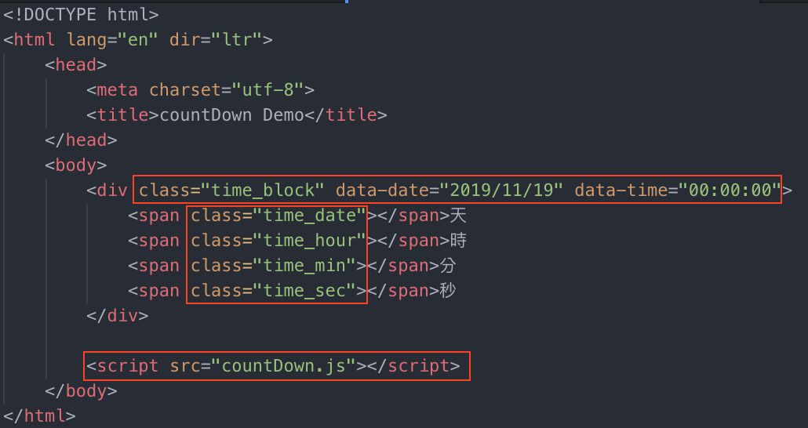

# countDown.js 倒數計時器

一個輕量化的倒數計時器，不需使用任何套件即可使用，引入 `countDown.js` 或 `countDown.min.js` 加上簡單的 `class` 以及 `data` 即可開始倒數計時。




# Install

把 `<script src="countDown.min.js"></script>` 插入在 `</body>` 前。

#### countDown.js

``` html
<script src="countDown.js"></script>
```

#### countDown.min.js

``` html
<script src="countDown.min.js"></script>
```

# Example

使用方式為：`class="time_block"` `data-date="YYYY/NN/DD"` `data-time="00:00:00"` `class="time_date"` `class="time_hour"` `class="time_min"` `class="time_sec"` 以上皆為必要元素。

`data-date` 為結束日期，格式為 `YYYY/NN/DD`。

`data-time` 為結束時間，格式為 24小時制。

``` html
<!DOCTYPE html>
<html>
    <head>
        <meta charset="utf-8">
        <title>countDownJS Demo</title>
    </head>
    <body>
        <div class="time_block" data-date="2019/12/31" data-time="00:00:00">
            <span class="time_date"></span> <!-- 天 -->
            <span class="time_hour"></span> <!-- 時 -->
            <span class="time_min"></span> <!-- 分 -->
            <span class="time_sec"></span> <!-- 秒 -->
        </div>

        <script src="countDown.min.js"></script>
    </body>
</html>
```
